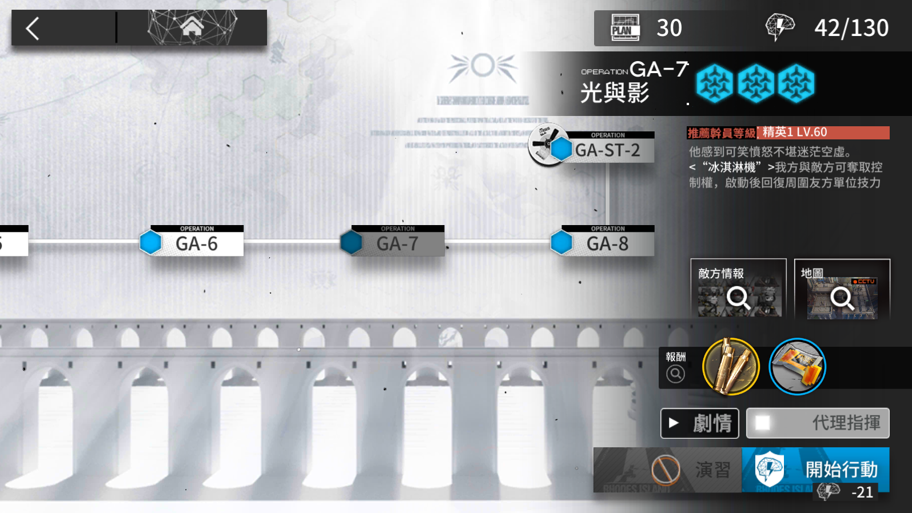

# アークナイツ自動ロボット

アークナイツのプレイヤーはイベントが来た時に、材料集めるため毎日特定のオパレーションを繰り返し作戦の事が必要です。それは本当につまらないですから、全自動化のプロセスを欲しいの。その夢は PC エミュレータで実行可能です。私は Nox エミュレータは良く使えます。


全体の過程は簡単だ。先ずは欲しいのオペレーションは一回自分で完了する。その後で自動操縦モードは使え事ができます。

## 環境設定

Python 3.10+ は必要です。そして`pipenv`パッケージマネージャも必修する。インストールの方は易い。

```
pip install pipenv
```

それからはこのリポジトリの中に仮想環境を作成する。

```
pipenv shell
```

最後にパッケージはインストールする。

```
pipenv install
```

やったー、準備完了！

## 第一歩

アクナイツイベントオペレーションページに移動する。



その後で「main.py」のスクリプトを実行する。

```
python main.py
```

それからは安心して離席するをできます。

## 第二歩

自動的に作戦準備のページに移動してます。


赤い作戦ボタンは自動クリックしてます。

## 第三歩

自動操縦モードはする事が何もありません。オペレーションが終るのことが待つだけだ。


## 最後の歩


オペレーションの終るときはイベントオペレーションページに戻る。第一歩から繰り返します。

もし sanity は足りないの場合は、プログラムの実行は止めます。


## 次は

Tkinter の UI は使えます。その後でテストを追加します。

## 参考

- [Pyautogui](https://pyautogui.readthedocs.io/en/latest/)
- [Black](https://black.readthedocs.io/en/stable/index.html)
