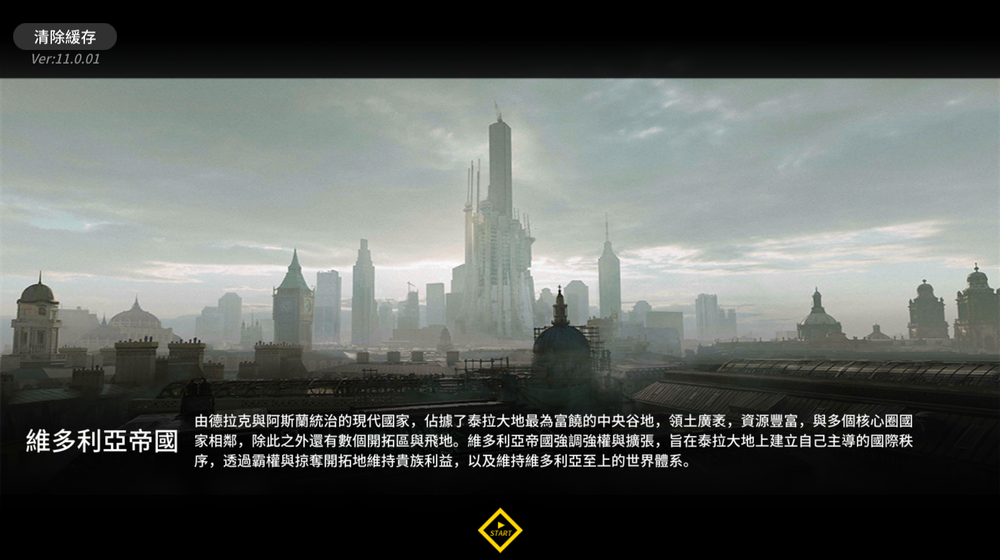
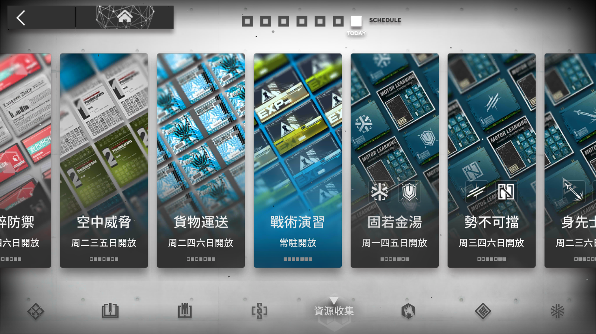
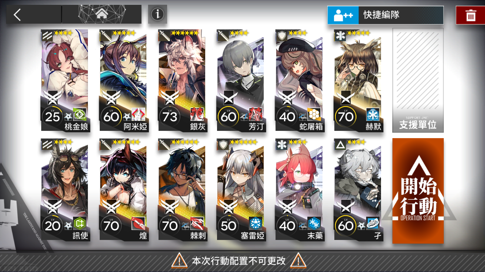
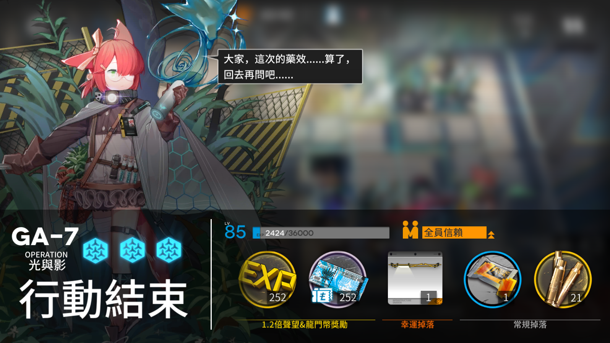

# アークナイツ行動助手

アークナイツは時間がかかるし、面倒くさいのゲームだ。材料集めるのためプレイヤーは毎日にこのゲーム時間を無駄にするの事が必要です。それは大変ですね、特にはイベント来たの時。

毎日は、特定のオパレーションを繰り返し作戦の事が本当につまらないですから、全自動化のプロセスを欲しいの。その夢は PC エミュレータで実行可能です。私は Nox エミュレータは良く使えます。


全体の過程は簡単だ。先ずは欲しいのオペレーションは一回自分で完了する。その後で自動操縦モードは使え事ができます。

> 注意事項：オートパイロットのモードはチェックしたの事が確認してください。

## 環境設定

Python 3.10+ は必要です。そして`pipenv`パッケージマネージャも必修する。インストールの方は易い。

```
pip install pipenv
```

それからはこのリポジトリの中に仮想環境を作成する。

```
pipenv shell
```

最後にパッケージはインストールする。

```
pipenv install
```

やったー、準備完了！

## 簡単の紹介

このプログラムはコマンドラインアプリです。先ずはプログラムの助けを借りましょう。

```
python main.py -h
```

その後はプログラムの機能を全て詳しく表示します。

```
usage: Arknights CLI [-h] [-stg {ca5,sk5,ce6,ls6,pra1,pra2,prb1,prb2,prc1,prc2,prd1,prd2}]
                     [-sl | --skip-login | --no-skip-login] [-sn | --skip-navigation | --no-skip-navigation]
                     [-fl | --first-login | --no-first-login] [-rc REFILL_COUNT] [-lo | --login-only | --no-login-only]
                     [-d [{ca5,sk5,ce6,ls6,pra1,pra2,prb1,prb2,prc1,prc2,prd1,prd2,all}]] [-t | --today | --no-today]

A CLI that automates the farming workflow for Arknights running on a PC emulator.

options:
  -h, --help            show this help message and exit
  -stg {ca5,sk5,ce6,ls6,pra1,pra2,prb1,prb2,prc1,prc2,prd1,prd2}, --stage {ca5,sk5,ce6,ls6,pra1,pra2,prb1,prb2,prc1,prc2,prd1,prd2}
                        the stage to be farmed
  -sl, --skip-login, --no-skip-login
                        flag to skip the login process from the landing page (default: False)
  -sn, --skip-navigation, --no-skip-navigation
                        flag to skip the navigation from home page to the destination stage (default: False)
  -fl, --first-login, --no-first-login
                        first login of the day (default: False)
  -rc REFILL_COUNT, --refill-count REFILL_COUNT
                        refill count to perform when the sanity runs out
  -lo, --login-only, --no-login-only
                        flag to just navigate to lobby screen from login (default: False)
  -d [{ca5,sk5,ce6,ls6,pra1,pra2,prb1,prb2,prc1,prc2,prd1,prd2,all}], --describe [{ca5,sk5,ce6,ls6,pra1,pra2,prb1,prb2,prc1,prc2,prd1,prd2,all}]
                        describe the stage info
  -t, --today, --no-today
                        show today's available stages (default: False)
```

### 変数の説明

以下のテーブルは上の変数を説明上げます。

| 変数   | 英語名前        | 説明                                                                       |
| ------ | --------------- | -------------------------------------------------------------------------- |
| `-h`   | help            | 英語で説明を上げます                                                       |
| `-stg` | stage           | ステージ。可能の値は有限です。既定の値は `ls6` です。                      |
| `-sl`  | skip login      | ログインのプロセスをスキップする。                                         |
| `-sn`  | skip navigation | ナビのプロセスをスキップする。                                             |
| `-fl`  | first login     | 当日の初めてログインですか？カレンダーポップアップ閉めじるのため必要。     |
| `-rc`  | refill count    | 理性を自動的に補充する。補充回数の引数を受け入れます。既定の値は一回です。 |
| `-lo`  | login only      | ログインだけです。                                                         |
| `-d`   | describe        | オペレーションの情報を表示する。                                           |
| `-t`   | today           | 今日のできるオペレーションを表示する。                                     |

## 作戦方法

### 正規作戦

このプログラムにはデフォルトでスタートページからオペレーション作戦まで全て自動的です。

```
python main.py <-stg?> <-fl?> <-rc?>
```

それは本当に便利です。節約した時間をもっと有意義な事に使えます。しばらくすると、理性はもう枯渇するはずです。嬉しいな。

### イベント作戦

イベントなら、自動ログインの事はできないです。欲しいのイベントオペレーションページに手動で移動するが必要です。


その後で「main.py」のスクリプトを実行する。

```
python main.py -sn -sl <-rc?>
```

それからは安心して離席するをできます。

## 流れ

### ログイン

上記のようにログインページからはじめできます。ログインページはこんな感じです。



次はログインページ２に到着します。


### ゲームロビー

後でロビーに到着。ロビーはこんな感じです。


### 目的地移動

ナビゲーションの順序はこんな感じです。

先ずは、


次は、



次は、


### ステージ選ぶ

ステージ選ぶ時は、青い行動開始のボタンは見えます。


イベントステージの選ぶことはこんな感じです。


### 作戦準備のページ

作戦準備のページに移動してます。



赤い作戦ボタンは自動クリックしてます。

### 作戦

自動操縦モードはする事が何もありません。オペレーションが終るのことが待つだけだ。


### 作戦完了



オペレーションの終るときはオペレーションページに戻ります。その後でもう一回の作戦は繰り返します。

もし理性は足りないと補充回数もありませんの場合は、プログラムの実行は止めます。


## 次は

- 使用レポート追加する。
- ランダムステージ作戦できます。
- テスト追加する。

## 有用なリンク

- [Pyautogui](https://pyautogui.readthedocs.io/en/latest/)
- [Black](https://black.readthedocs.io/en/stable/index.html)
